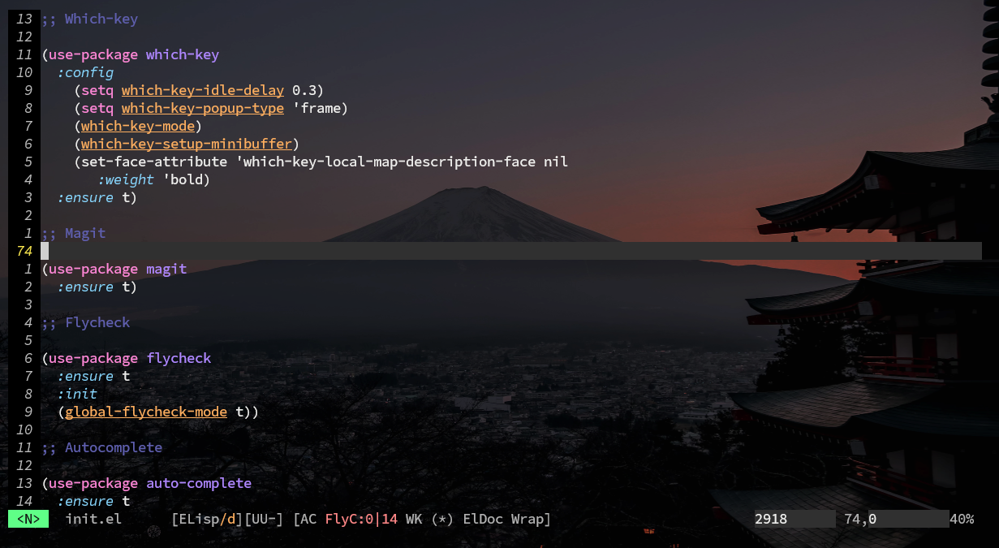

# Minhas Configurações no Emacs
## Carregando o Arquivo "init.el"
Em algumas distribuições Linux derivadas do Fedora e Ubuntu, pode ocorrer de o arquivo "init.el" não ser carregado automaticamente. A alternativa que encontrei para aplicar as configurações de personalização foi chamar o arquivo `init.el` dentro do arquivo `.emacs` para garantir que ele seja carregado na inicialização do Emacs. O arquivo pode ter outro nome, desde que termine com ".el".

```emacs-lisp
(load "~/.emacs.d/init.el")
```

Remapeei algumas teclas para melhorar a produtividade. A configuração ficou bem parecida com o Vim, utilizando o tema "evil".

### Aplicando as configurações no arquivo `.emacs`:
- 1 - Primeiro iremos adicionar os repositórios necessários no arquivo `.emacs` localizado na pasta home.

```emacs-lisp
(require 'package)
(setq package-enable-at-startup nil)
(setq package-archives '(("melpa" . "https://melpa.org/packages/")
                         ("gnu" . "https://elpa.gnu.org/packages/")
                         ("org" . "https://orgmode.org/elpa/")))
(package-initialize)
```
- 2 - Agora iremos adicionar o `use-package` para que possamos instalar os pacotes.

```emacs-lisp
(require 'use-package)
(use-package org
  :ensure t)
```
- 3 - Configuração do tema `evil` para deixar as configurações de teclas iguais a do `vim`.
  
```emacs-lisp
(use-package evil
  :ensure t
  :config
  (evil-mode 1))
```
>[!NOTE]
Para aplicar as modificações no arquivo podemos ir no final de cada linha, para avaliar o código e aplicar as modificações com as seguintes teclas `Ctrl + x` e `Ctrl + e` ou utlizar o `Alt + x` e digitar o seguinte comando no console `eval-region`.

Configurações Adicionais
Deixarei os arquivos ".emacs" e "init.el" com os ajustes necessários para aplicar as modificações.

### Aplicando as configurações no arquivo `init.el`:
- 1 - Desabilitando a memsagem de boas vimdas do Emacs.
```emacs-lisp
(setq inhibit-startup-message t) 
```
- 2 - Ativar a numeração de linhas.
```emacs-lisp
(global-display-line-numbers-mode)
(setq display-line-numbers-type 'relative) 
```
- 3 - Personalizar a aparência dos números de linha.
```emacs-lisp
(set-face-attribute 'line-number nil
                    :foreground "gray"
                    :background "black"
                    :weight 'bold)
(set-face-attribute 'line-number-current-line nil
                    :foreground "yellow"
                    :background "black"
                    :weight 'bold) 
```
- 4 - Ocultar barra de menu, barra de ferramentas e barra de rolagem
```emacs-lisp
(scroll-bar-mode -1)
(tool-bar-mode -1)
(menu-bar-mode -1)
```
- 5 - Atalhos de teclado
```emacs-lisp
(global-set-key (kbd "<f5>") 'revert-buffer)         ;; Atualizar buffer
(global-set-key (kbd "<f3>") 'org-export-dispatch)   ;; Exportar modo org
(global-set-key (kbd "<f6>") 'eshell)                ;; Abrir eshell
(global-set-key (kbd "<f7>") 'ranger)                ;; Abrir ranger
(global-set-key (kbd "<f8>") 'magit)                 ;; Abrir magit 
```

- 6 - Powerline do Evil Mode
```emacs-lisp
(use-package powerline-evil
  :ensure t)
(powerline-evil-vim-theme)
(powerline-evil-vim-color-theme) 
```
- 7 - Destacar a linha atual
```emacs-lisp
(global-hl-line-mode t) 
```
- 8 - Carregar tema Dracula
```emacs-lisp
(use-package dracula-theme
  :ensure t
  :config
  (load-theme 'dracula t))
```

- 9 - Ativar modo Beacon
```emacs-lisp
(use-package beacon
  :ensure t
  :config
  (beacon-mode 1)) 
```
- 10 - Pacote Try para experimentar novos pacotes
```emacs-lisp
(use-package try
  :ensure t) 
```
- 11 - Which-key para exibir possíveis atalhos de teclado
```emacs-lisp
(use-package which-key
  :ensure t
  :config 
  (setq which-key-idle-delay 0.3)
  (setq which-key-popup-type 'frame)
  (which-key-mode)
  (which-key-setup-minibuffer)
  (set-face-attribute 'which-key-local-map-description-face nil 
                      :weight 'bold)) 
```

- 12 -  Magit para integração com Git
```emacs-lisp
(use-package magit
  :ensure t) 
```
- 13 - Flycheck para verificação de sintaxe
```emacs-lisp
(use-package flycheck
  :ensure t
  :init
  (global-flycheck-mode t)) 
```
- 14 -Auto-complete para autocompletar texto
```emacs-lisp
(use-package auto-complete
  :ensure t
  :config 
  (ac-config-default)) 
```
- 15 - Emmet Mode para HTML e CSS
```emacs-lisp
(use-package emmet-mode
  :ensure t
  :config 
  (add-hook 'sgml-mode-hook 'emmet-mode) ;; Auto-iniciar em qualquer modo de marcação
  (add-hook 'css-mode-hook  'emmet-mode)) ;; Ativar abreviação CSS do Emmet 
```

- 16 - Modo Markdown
```emacs-lisp
(global-set-key (kbd "C-c m") 'markdown-mode)
(use-package markdown-mode
  :ensure t
  :mode (("README\\.md\\'" . gfm-mode)
         ("\\.md\\'" . markdown-mode)
         ("\\.markdown\\'" . markdown-mode))
  :init (setq markdown-command "multimarkdown"))
```
- 17 - RestClient para testar APIs REST
```emacs-lisp
(use-package restclient
  :ensure t)
```
- 18 - Ativar modo visual line para quebra suave de linha
```emacs-lisp
(global-visual-line-mode t)
```

- 19 - Configurar modo fringe para espaçamento lateral
```emacs-lisp
(set-fringe-mode 10)
```

- 20 - Organizar backups
```emacs-lisp
(setq backup-directory-alist `(("." . "~/.save")))
```

- 21 -  Neotree explorador de árvore de arquivos
```emacs-lisp
(use-package neotree
  :ensure t
  :config
  (setq neo-theme (if (display-graphic-p) 'icons 'arrow))
  :bind (("C-\\" . 'neotree-toggle)))
```

- 22 - Pyvenv para suporte a ambientes virtuais Python
```emacs-lisp
(use-package pyvenv
  :ensure t
  :config
  (pyvenv-mode 1))
```

- 23 - Modo Web para HTML, CSS e JavaScript
```emacs-lisp
(use-package web-mode
  :ensure t
  :mode ("\\.html?\\'" "\\.css?\\'" "\\.js?\\'"))
```

- 24 - Configuração do Modo Org para linguagens
```emacs-lisp
(unless (package-installed-p 'ob-ipython)
  (package-install 'ob-ipython))

(org-babel-do-load-languages
 'org-babel-load-languages
 '((shell . t)
   (ipython . t)))
```
##### Abaixo Algumas images com o sistema personalizado



