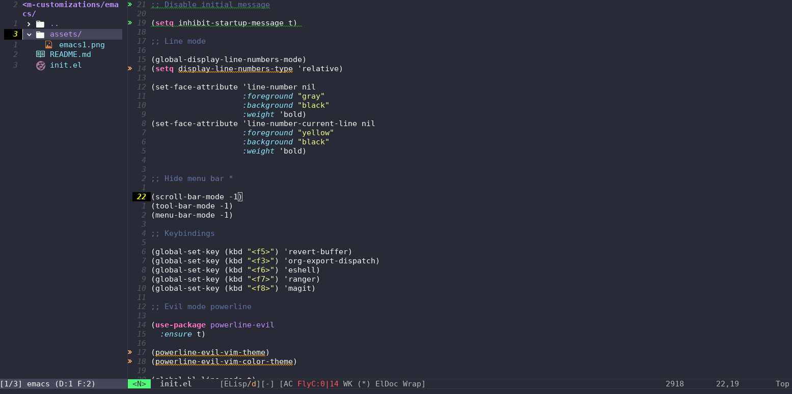

# Minhas Configurações no Emacs
## Carregando o Arquivo "init.el"
Em algumas distribuições Linux derivadas do Fedora e Ubuntu, pode ocorrer de o arquivo "init.el" não ser carregado automaticamente. A alternativa que encontrei para aplicar as configurações de personalização foi chamar o arquivo `init.el` dentro do arquivo `.emacs` para garantir que ele seja carregado na inicialização do Emacs. O arquivo pode ter outro nome, desde que termine com ".el".

```emacs-lisp
(load "~/.emacs.d/init.el")
```

Remapeei algumas teclas para melhorar a produtividade. A configuração ficou bem parecida com o Vim, utilizando o tema "evil".

### Aplicando as configurações no arquivo `.emacs`:
- Primeiro iremos adicionar os repositórios necessários no arquivo `.emacs` localizado na pasta home.

```emacs-lisp
(require 'package)
(setq package-enable-at-startup nil)
(setq package-archives '(("melpa" . "https://melpa.org/packages/")
                         ("gnu" . "https://elpa.gnu.org/packages/")
                         ("org" . "https://orgmode.org/elpa/")))
(package-initialize)
```
- Agora iremos adicionar o `use-package` para que possamos instalar os pacotes atravez deles.

```emacs-lisp
(require 'use-package)
(use-package org
  :ensure t)
```
- Configuração do tema `evil` para deixar as configurações de teclas iguais a do `vim`.
  
```emacs-lisp
(use-package evil
  :ensure t
  :config
  (evil-mode 1))
```
>[!NOTE]
Para aplicar as modificações no arquivo podemos ir no final de cada linha, para avaliar o código e aplicar as modificações com as seguintes teclas `Ctrl + x` e `Ctrl + c` ou utlizar o `Alt + x` e digitar o seguinte comando no console `eval-region`.

Configurações Adicionais
Deixarei os arquivos ".emacs" e "init.el" com os ajustes necessários para aplicar as modificações.

##### Abaixo Algumas images com o sistema personalizado


