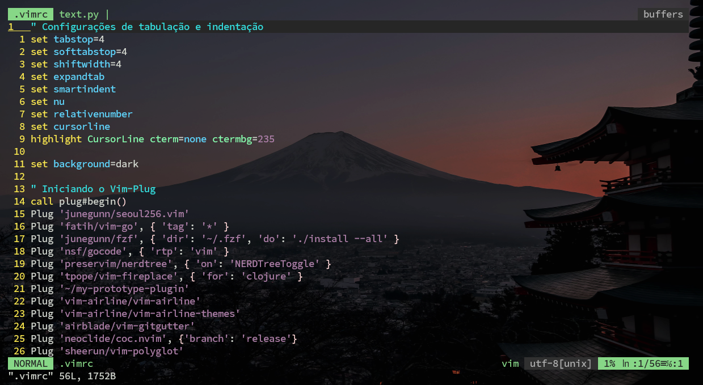
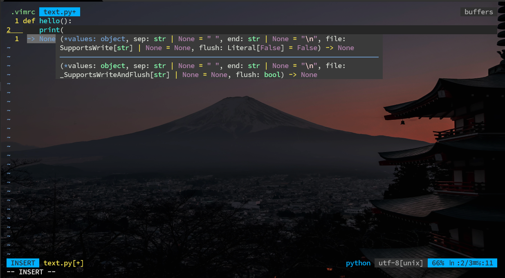

# Minhas Configurações no VIM
## Para adicionar alguns `temas` e `pugins`, precisamos de um gerenciador de pacotes vamos utilizar o `vim-plug`

### Repositório do `vim-plug` com o rutorial de instalação.

```url
https://github.com/junegunn/vim-plug
```
>[!NOTE]
Para aplicar as modificações apertamos `ESC` + `:` e digitamos o seguinte Comando:
>```vim
>PlugInstall
>```
>Depois é só reiniciar o vim e as modificações serão aplicadas

#### Funcionalidades:

- 1 - Configurações de tabulação e indentação

```vim
set tabstop=4
set softtabstop=4
set shiftwidth=4
set expandtab
set smartindent
set nu
set relativenumber
set cursorline
set background=dark

highlight CursorLine cterm=none ctermbg=235
```

- 2 - Iniciando o Vim-Plug

```vim
call plug#begin()
Plug 'junegunn/seoul256.vim'
Plug 'fatih/vim-go', { 'tag': '*' }
Plug 'junegunn/fzf', { 'dir': '~/.fzf', 'do': './install --all' }
Plug 'nsf/gocode', { 'rtp': 'vim' }
Plug 'preservim/nerdtree', { 'on': 'NERDTreeToggle' }
Plug 'tpope/vim-fireplace', { 'for': 'clojure' }
Plug '~/my-prototype-plugin'
Plug 'vim-airline/vim-airline'
Plug 'vim-airline/vim-airline-themes'
Plug 'airblade/vim-gitgutter'
Plug 'neoclide/coc.nvim', {'branch': 'release'}
Plug 'sheerun/vim-polyglot'
call plug#end()
```

- 3 - Configurações do vim-airline

```vim
let g:airline#extensions#tabline#enabled = 1
let g:airline#extensions#branch#enabled = 1
let g:airline#extensions#hunks#enabled = 1
let g:airline#extensions#hunks#non_zero_only = 1
let g:airline#extensions#wordcount#enabled = 0
let g:airline_theme = 'deus'
```

- 4 - Configurações do vim-gitgutter

```vim
let g:gitgutter_enabled = 1
```

- 5 - Configurações do CoC (autocomplete)

```vim
let g:coc_global_extensions = ['coc-snippets', 'coc-pyright', 'coc-json', 'coc-html', 'coc-css', 'coc-tsserver']
```

- 6 - Mapeamentos para o CoC

```vim
inoremap <silent><expr> <TAB> pumvisible() ? "\<C-n>" : "\<TAB>"
inoremap <silent><expr> <S-TAB> pumvisible() ? "\<C-p>" : "\<S-TAB>"
```

- 7 - Ajustando as cores do CoC

```vim
highlight CocMenuSel ctermfg=0 ctermbg=3 guifg=#000000 guibg=#FFFF00
highlight CocPumSearch cterm=bold ctermfg=12 ctermbg=gray guifg=#005f87 guibg=#262626
highlight CocPumVirtualText ctermfg=8 guifg=#808080
```
- 8 - Ativando a sintaxe e plugins de linguagem

```vim
syntax on
filetype plugin indent on
```

##### Imagem do `VIM` com as modificações aplicadas.




